Contents

[1        Marc Record to CSV        2](#h.gjdgxs)

[2        Gathering Fields in Marc Records        6](#h.30j0zll)

[3        MODS to CSV        10](#h.1fob9te)

[3.1        Batch Processing MODS to Marc (might not
work)        10](#h.3znysh7)

[3.2        Individual Conversion MODS to MARC        12](#h.2et92p0)

[3.3        Combine Individual Marc Records into One Marc
Record        14](#h.tyjcwt)

[3.4        Convert Combined Marc To CSV (Same as Section
1)        18](#h.3dy6vkm)

* * * * *

1.  Marc Record to CSV {#h.gjdgxs style="display:inline"}
    ==================

This section allows for users to convert MARC Records to Delimited
Records (Tab; pipe(|) or comma(,)).  The program requires users to enter
the MARC fields they want exported into the CSV file (i.e. 001, 100).
 In order to determine what fields are being used in the desired MARC
Record look at the second section titled: [Gathering Fields in Marc
Records](#h.30j0zll).  This will provide the user with a report of all
the MARC fields being used in the MARC record, along with the how often
the field appears in the Record.  The user might want to use this report
to compile a list of fields they want ingested.  In order to do this
they need to create a plain text (.txt) file with the first line:
\#NORMAL:\#true followed by the fields wanted on a new line (see image
to the left). Additionally the user should be aware that grabbing MARC
fields without defining sub categories will result in a cell with all
subcategories for that record.  For example, if the report says that
there is a 245 field with \$a, \$b and \$c subfield, then grabbing 245
will make the cell appear in the following fashion: \$a [Title of Book]
: \$b [Sub TItle of Book] / \$c [Statement of Responsibility]. Step 8a
shows users how to import a txt file with preloaded fields while 8b
shows users how to import fields manually.  The screenshots below are
from a MacBook, MarcEdit with another operating system (i.e. Windows)
might appear slightly different. 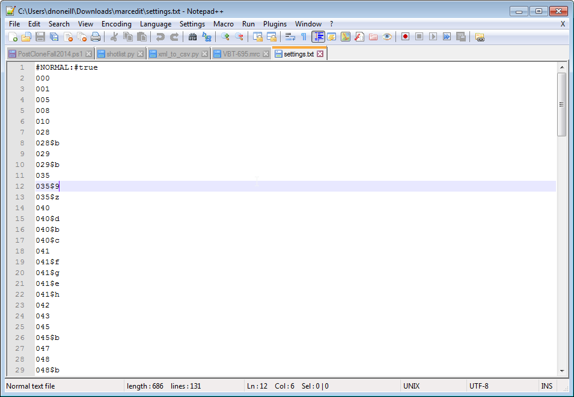

1.  Open MarcEdit
2.  Click on the Tools Menu
3.  Choose Export Records
4.  Choose Export Tab Delimited Records

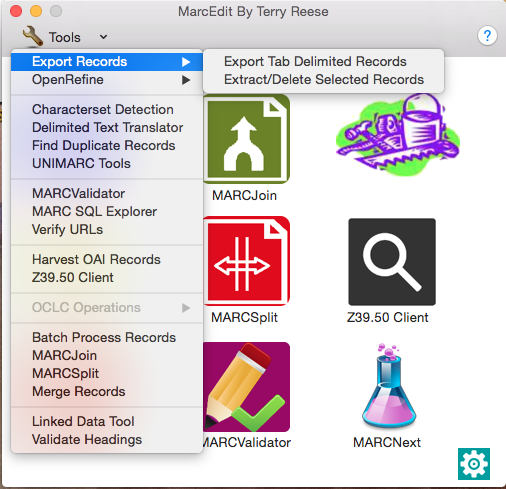

Steps 2,3,4

5.  Under the MARC File:  Enter the file path of the marc record (red
    arrow)
6.  Under Save File: Enter the file path and name of the output record
    (blue arrow)
7.  Under Delimiter choose desired delimiter (comma, tab, pipe) (green
    arrow)

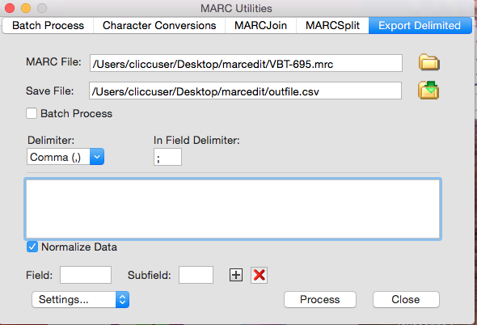

Steps 5,6,7

8.  Load Settings (Fields to be exported to csv file).  This can be done
    one of two ways:

1.  Load a txt file that has all of the fields you want exported

1.  Click Settings

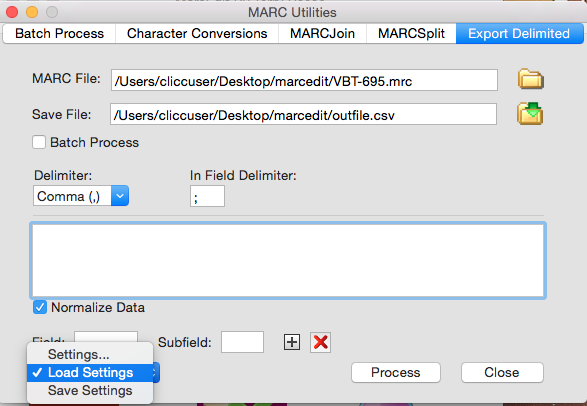

2.  Choose settings file you have already created and click open

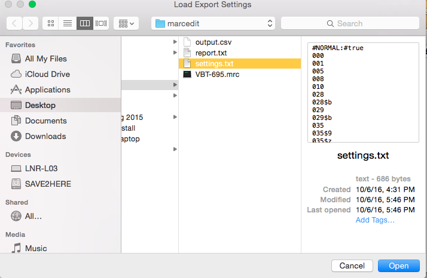

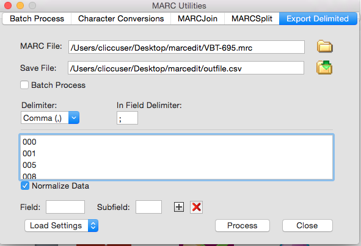

2.  Enter the field and subfield into the Field and Subfield boxes and
    click on the + button.  This has to be done for each field.

9.  Click Process

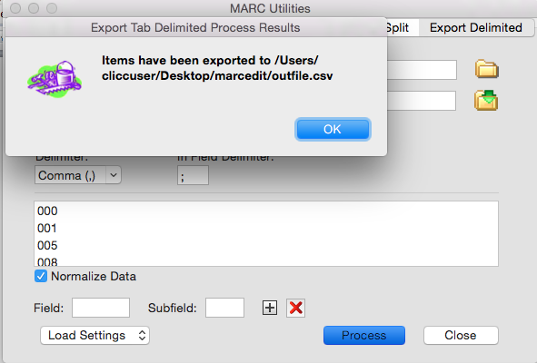

2.  Gathering Fields in Marc Records {#h.30j0zll style="display:inline"}
    ================================

This section will inform users on how to gather the fields and subfields
being used in a MARC record.  The report will produce a file with the
following information: the field, the subfield, the number of records
the field (does not apply to subfield) occurs in, and the total number
of occurrences of the field or subfield (this number includes multiples
in a field which are counted by semicolons).  This file is saved as a
txt file, but formats better if opened with excel or spreadsheet
software.  

1.  Open MarcEdit
2.  Click on MarcEditor
3.  Click on the File Menu
4.  Choose Open

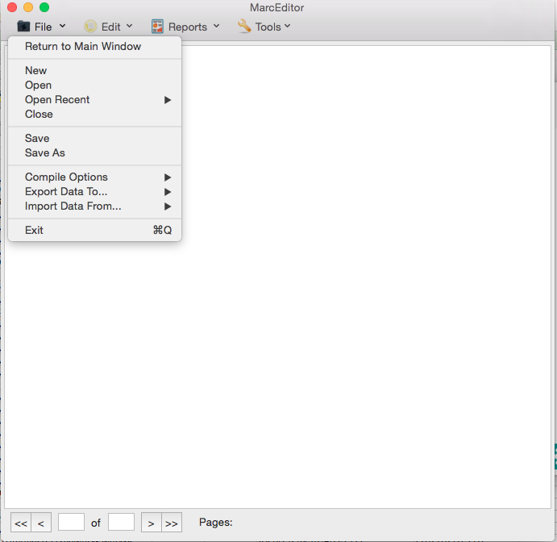

Steps 3 ,4

* * * * *

5.  Choose the correct Marc record and Open

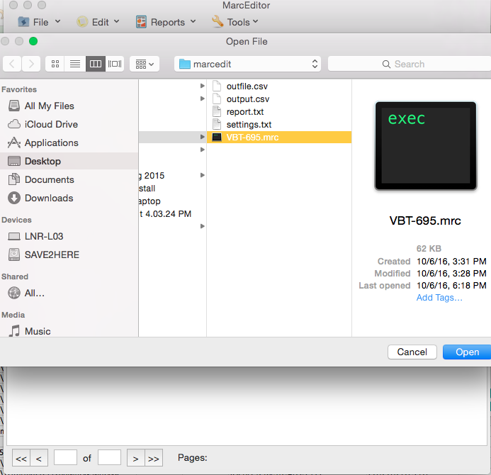

* * * * *

6.  Choose the Reports Menu
7.  Choose Field Count

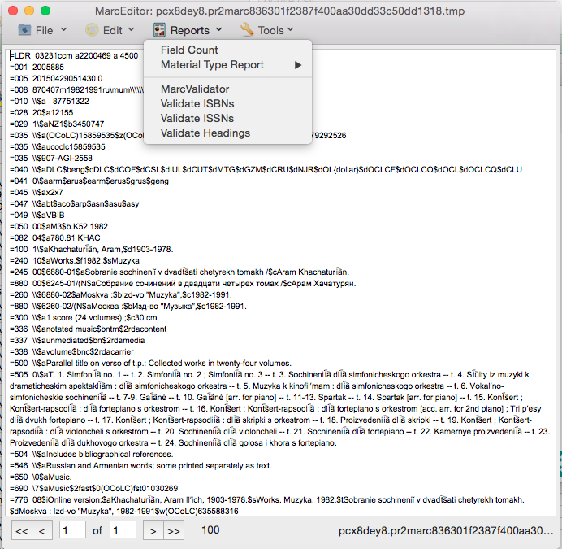

Steps 6, 7

* * * * *

8.  Click on Generate Report

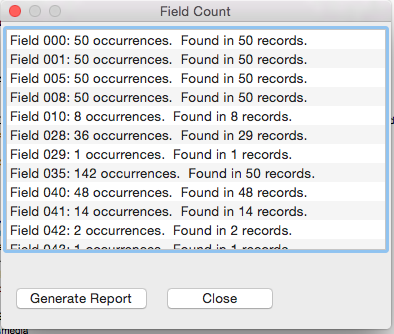

9.  Save to txt file. (Sample seen below)

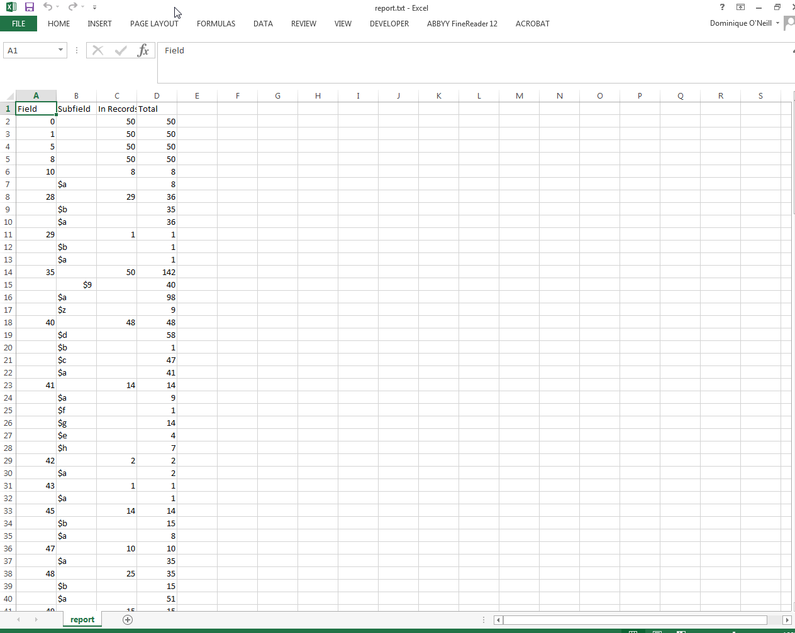

3.  MODS to CSV {#h.1fob9te style="display:inline"}
    ===========

MARC is the best form of structured metadata to convert into a csv,
however other formats can be converted.  Converting from MODS to CSV is
somewhat circuitous.  It requires the user to convert the MODS records
into MARC using MARCEdit’s capabilities.  Unfortunately if the MODS
records are in individual files this requires a multi-step process and
often these have to be converted one at a time.

The following section (3.1) shows how to use Batch Edit, however I was
unable to get it to work. I believe the problem has to do with the
encoding of the MODS records I was using.  If the user can get batch
edit to work, they should skip to section 3.4 which are the same steps
as Section 1.  If you are unable to get Section 3.1 to work you should
move on to 3.2 which shows how to individually convert MODS files.
 Section 3.3 shows how to combine multiple converted MARC records (from
section 3.2) into one MARC record.  Section 3.4 shows how to convert a
MARC record into a CSV (Same as Section 1).

1.  Batch Processing MODS to Marc (might not work) {#h.3znysh7 style="display:inline"}
    ----------------------------------------------

1.  Open Tools \> Batch Process
    Records
2.  Enter the directory containing the MODS files
3.  Enter the file type of xml
4.  Change the Function to
    MODS=\>MARC
5.  Click Process

Error Screen

2.  Individual Conversion MODS to MARC {#h.2et92p0 style="display:inline"}
    ----------------------------------

If you run into this error screen from section 3.1, you must convert
these MODS records to MARC individually.  Here are the following steps
on how to do so.

1.  Open MARC Tools

2.  Choose the correct input file (xml)
3.  Enter Save file location.  Make sure the extension is mrc
4.  Change Function List to MODS=\>MARC
5.  Change Default Character Encoding to
    UTF8 
6.  Click Execute
7.  Repeat with all MODS files

* * * * *

3.  Combine Individual Marc Records into One Marc Record {#h.tyjcwt style="display:inline"}
    ----------------------------------------------------

If you were unable to convert MODS to MARC in batch and had to do so
individually perform the following steps to convert the individual files
into one large file.  This is necessary if you are going to convert
these records into one CSV file.

1.  Click on MARCJoin

2.  Enter the location of the combined file into Save File
3.  Click on the folder icon next to File(s) to Join

4.  Highlight the files to join
5.  Click Open

6.  Click Process

4.  Convert Combined Marc To CSV (Same as Section 1) {#h.3dy6vkm style="display:inline"}
    ------------------------------------------------

1.  Open MarcEdit
2.  Click on the Tools Menu
3.  Choose Export Records
4.  Choose Export Tab Delimited Records

Steps 2,3,4

5.  Under the MARC File:  Enter the file path of the marc record (red
    arrow)
6.  Under Save File: Enter the file path and name of the output record
    (blue arrow)
7.  Under Delimiter choose desired delimiter (comma, tab, pipe) (green
    arrow)

Steps 5,6,7

8.  Load Settings (Fields to be exported to csv file).  This can be done
    one of two ways:

1.  Load a txt file that has all of the fields you want exported

1.  Click Settings

2.  Choose settings file you have already created and click open

2.  Enter the field and subfield into the Field and Subfield boxes and
    click on the + button.  This has to be done for each field.

9.  Click Process

